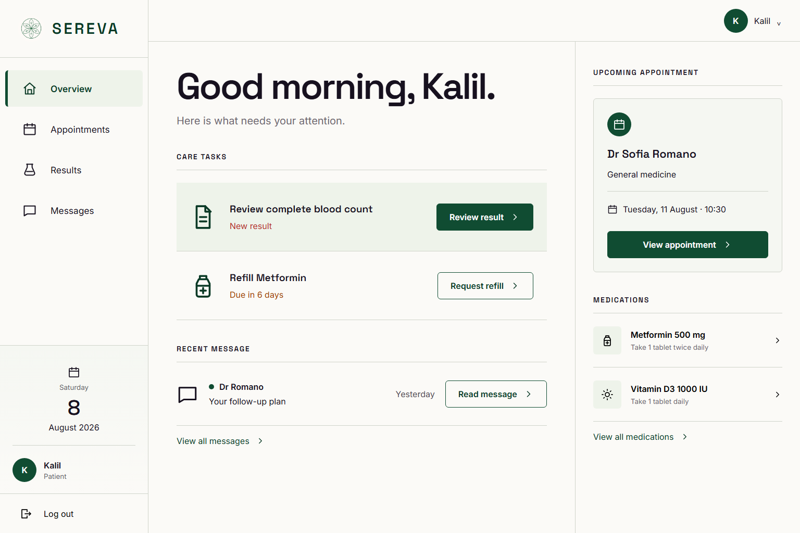

# SEREVA — Accessible Patient Portal

[](https://github.com/kalil-tg/sereva-patient-portal/actions/workflows/quality.yml)


SEREVA is a patient-facing portal for viewing lab results, understanding trends, and requesting a medication refill. It demonstrates how sensitive health information can be presented with clear hierarchy, explicit status, accessible data alternatives, and reliable interaction feedback.



## Product outcome

- Responsive patient dashboard with persistent navigation
- Lab-results table with row headers and text-backed status
- Accessible SVG trend chart with title, description, and data table
- Medication-refill dialog with labelled controls and confirmation state
- Focus movement, skip navigation, large targets, and overflow protection
- Reduced-motion handling and non-colour-dependent communication

## Engineering evidence

- Five Playwright end-to-end tests
- Automated axe-core coverage for the remediated application states
- Keyboard, modal, table, chart-data, and mobile-overflow checks
- Controlled legacy result preserving expected baseline defects
- GitHub Actions workflow for install, lint, build, and browser tests

## Stack

React 19 · TypeScript · Vite · CSS · Playwright · axe-core

## Run locally

```bash
pnpm install
pnpm dev
```

## Verify

```bash
pnpm lint
pnpm build
pnpm test:e2e
```

## Documentation

- [Case study](docs/CASE_STUDY.md)
- [Accessibility audit](docs/ACCESSIBILITY_AUDIT.md)
- [Design system](docs/DESIGN_SYSTEM.md)
- [Fidelity ledger](docs/FIDELITY_LEDGER.md)
- [Manual QA plan](docs/MANUAL_QA_PLAN.md)

## Portfolio

[View the published SEREVA case study on Contra](https://contra.com/p/vLg6cLWR-sereva-accessible-patient-portal-and-lab-results)

> SEREVA is a self-initiated portfolio case study for a fictional health product. It is not paid client work, medical advice, legal certification, or a claim of complete assistive-technology conformance.
